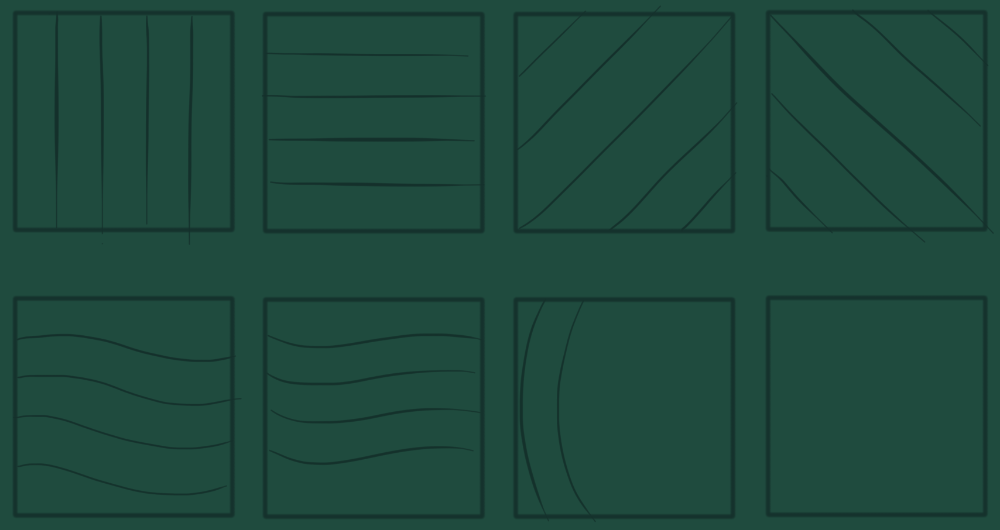
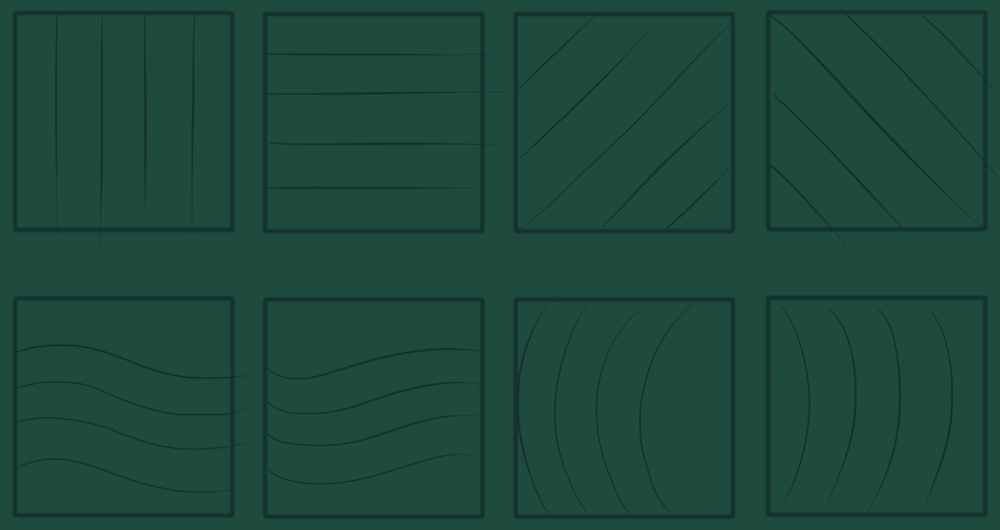
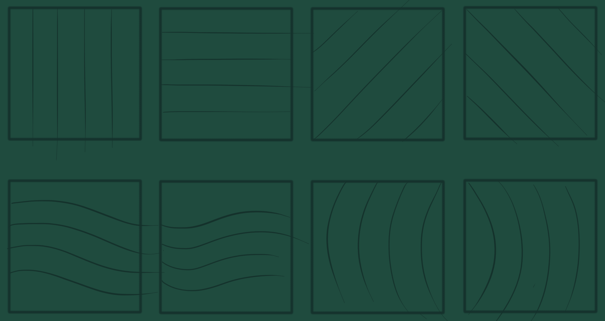

## Improving Linework

3 days a week I sat down and set a timer of 30 minutes to finish these exercises

### Day 1 (_Week 1_)
Couldn't finish that up, huh :grimacing:

### Day 2 (_Week 1_)
That one I did it in time :relieved:

### Day 3 (_Week 1_)
Crossed the line limits a lot on this one :triumph:
